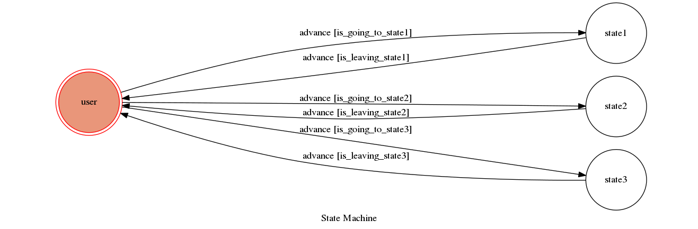

TOC Project 2017
===

## Setup
### Environment
+ see requirements.txt

### Sensitive data
1. api_token.json: a .json contain following text
```
{"api_token":[{"token":"PUT TOKEN HERE!!!!"}]}
```
2. tunnels.json: create itself when running app.py

## Run Locally
1. First terminal
```
$ ./ngrok http 5000
```
1. Second terminal
```
$ cd TOC-Project-2017/
$ python3 app.py
```

## Finite State Machine


## Usage
Initial state: `user`
Input `go to state1` then bot go to state1 state in user state.
In state1, bot will say hello with your first name, and send a image.
Typing any thing in state1 you will always receive `OuO`.
If you type `give me fsm` bot will send a fsm url and go back user state.

Input `go to state2` then bot go to state2 state in user state.
In state2, bot will repeat what you type until input `go back`.

Input `go to state3` then bot go to state3 state in user state.
In state2, bot will send .mp3 about what you type until input `go back`.

## Bonus
+ Get WEBHOOK_URL automatically.
+ Open fsm in browser automatically.
+ Keep token in api_token.json not app.py directly.
+ Can send images.
+ Can send mp3 according to user typing.

## Author
[Lee-W](https://github.com/Lee-W)
[Huang Po-Hsuan](https://github.com/aben20807)
